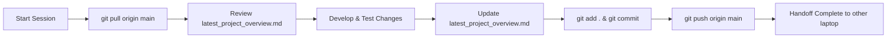

# 📚 Librika (e-pathshala) — Latest Project Overview & Handoff

> **Synchronized Workflow Document**: This document is updated whenever work completes on either laptop. Before starting any work on any machine, always pull latest changes first.

---

## 🔄 Cross-Laptop Development Workflow

To seamlessly work on this project across multiple laptops via GitHub, follow this strict protocol:



### 1. Starting Work (On Either Laptop)
```bash
# Always pull the freshest code and overview before opening any code editors:
git status
git pull origin main
```
*Read this file (`latest_project_overview.md`) to see what was completed last and what's next.*

### 2. Ending Work (On Either Laptop)
```bash
# 1. Update this file (latest_project_overview.md) with what you did and next tasks
# 2. Stage changes (ensure no secret keys or cookies are added)
git add .
# 3. Commit with a clear descriptive message
git commit -m "feat/fix: descriptive commit message"
# 4. Push to GitHub
git push origin main
```

---

## 🔐 Credentials & Sensitive Files (DO NOT COMMIT)

The following files are excluded in `.gitignore` to prevent credential exposure:
1. **`.env`**: Contains production MySQL, NVIDIA API, Supabase, Brevo, Gmail SMTP, and JaaS keys.
2. **`jaas_private_key.pk`**: RSA private key required to generate JaaS (8x8.vc) meeting tokens.
3. **`PROJECT_CREDENTIALS_AND_CONFIG.md`**: Master credentials sheet with MilesWeb SSH, database passwords, and AI keys.
4. **`cookies.txt`** / session tokens.
5. **`*.db`**: Local SQLite database files (`library_v3.db`).

### ⚠️ Transfer Checklist for Laptop B:
When setting up Laptop B for the first time:
- Clone repo: `git clone git@github.com:Om-collab-eng/e-pathshala.git` (or HTTPS clone).
- Securely copy `.env` and `jaas_private_key.pk` from Laptop A to Laptop B (via AirDrop, encrypted USB, or 1Password/Bitwarden).
- Run `npm install`.

---

## 🏗️ Architecture & Tech Stack

| Component | Technology | Details |
| :--- | :--- | :--- |
| **Runtime & Framework** | Node.js (>=20.0), Express 5 | `app.js` -> `server_new.js` |
| **Templating Engine** | EJS, `ejs-mate`, `express-ejs-layouts` | Views in `/views` and `/templates` |
| **Database Architecture** | Dual Engine (MySQL & SQLite) | `db.js`: Production uses MilesWeb MySQL (`librika_1_librika`); Local dev falls back to SQLite (`library_v3.db`) |
| **Real-time & Meetings** | Socket.IO + 8x8 JaaS WebRTC | `services/liveSocket.js`, `services/jaasService.js` |
| **AI Assistants & OCR** | NVIDIA NIM, OpenRouter, Tesseract.js | Llama 3.1 70B & Llama 3.2 11B Vision for OCR and study assistant |
| **Email Service** | Nodemailer (Gmail SMTP & Brevo) | `librika.in@gmail.com` |
| **Sessions** | `express-session`, `express-mysql-session` | 30-day persistent sessions |

---

## 📦 Key Portals & System Modules

1. **Modern Student Portal (`/student`, `student_routes.js`)**:
   - 10 unified modules:
     1. Dashboard & Progress
     2. Catalog & Discovery
     3. Reading Room & PDF Viewer
     4. AI Study Assistant & Doubt Solver
     5. Digital Content & Student Publications
     6. Collaborative Study Rooms
     7. Quizzes, Mock Tests & Flashcards
     8. Live Video Meetings & Virtual Classrooms (`/meetings`)
     9. Reading Activity, History & Bookmarks
     10. Profile & Account Settings
2. **Librarian Management System (`/librarian`)**:
   - Physical book cataloging, circulation (issue/return), barcode scanning, student membership, fine management, and inventory auditing.
3. **Super Admin CMS (`/super-admin`)**:
   - Multi-tenant institution management, platform analytics, subscription & billing management, and dynamic announcement/ads ticker engine.
4. **Live Virtual Meeting & Classroom Engine (`/meetings`)**:
   - Powered by 8x8 JaaS (Jitsi as a Service).
   - Generates RS256 JWT tokens via `services/jaasService.js`.
   - Host/moderator and student role-based access.

---

## ⚡ Running the Project Locally

```bash
# 1. Install dependencies
npm install

# 2. Check environment variables
# Ensure .env is present with either MySQL config or default local SQLite fallback

# 3. Start server
npm start
# or for hot reloading:
npm run dev

# Server runs on: http://localhost:3000 (or PORT in .env)
```

---

## 📋 Recent Changelog & Completed Work

- **`8dcef26`**: Fixed dynamic ticker ad click tracking with valid JSON payload and headers.
- **`5bc13fa`**: Implemented dynamic e-library announcements, banner slider, and educational facts ticker with Super Admin CMS management.
- **`499d528`**: Integrated "Publish Content" and "My Publications" directly into the unified modern Student Portal.
- **`e4f7b9f`**: Unified all student navigation into the modern 10-module portal.
- **`4f90c62`**: Fixed static middleware index intercept and updated OCR branding.
- **JaaS Video Conferencing**: Added `services/jaasService.js` and migration `db/initMeetingTables.js`.
- **Security**: Updated `.gitignore` to strictly exclude `cookies.txt`, `*cookies*.txt`, `.stfolder/`, and private keys.

---

## 🎯 Next Steps / Active Tasks

- [ ] Push local commits (`git push origin main`) to update remote repository.
- [ ] On Laptop B: clone repository and copy over `.env` and `jaas_private_key.pk`.
- [ ] Run `npm install` on Laptop B and verify server boots on `http://localhost:3000`.
- [ ] Run meeting table migration on local/production database if not yet applied (`node db/initMeetingTables.js`).
